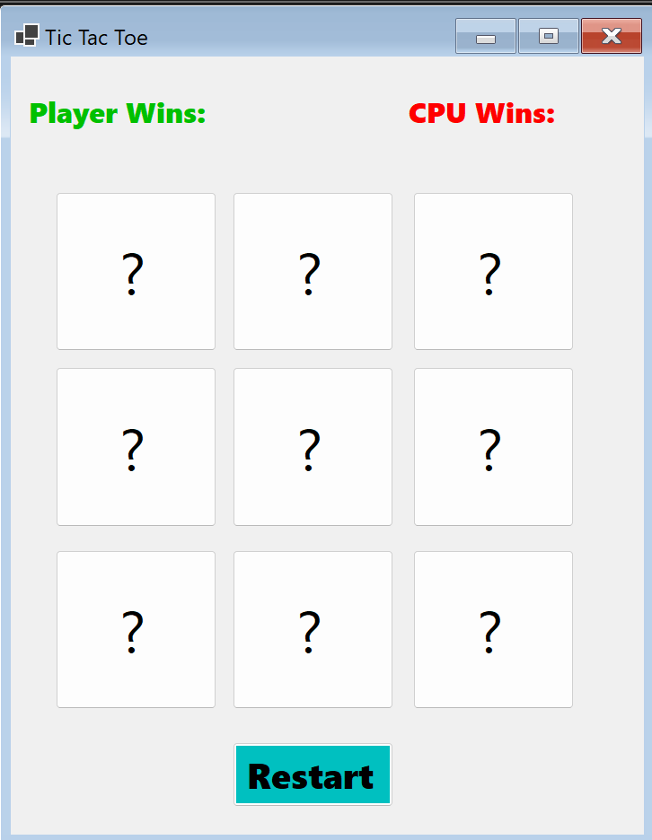

# 🎮 Tic Tac Toe Game (C# - Windows Forms)

Ein klassisches **Tic Tac Toe Spiel** mit intelligenter CPU, entwickelt mit **C# und Windows Forms**.  
Die CPU nutzt den **Minimax-Algorithmus**, um immer den besten Zug zu spielen – sie kann also nicht verlieren.

---

## 🧠 Features

- ✔️ Spieler vs. CPU
- 🤖 Perfekte CPU dank Minimax-Algorithmus
- 🧠 Automatische Sieg- und Unentschieden-Erkennung
- 📊 Punktestand-Anzeige für Spieler und CPU
- 🔁 Spiel-Neustart auf Knopfdruck
- 🎨 Optische Hervorhebung der Spielerzüge (Farben & Symbole)

---

## 🖥️ Technologien

- C# (Windows Forms)
- .NET Framework
- Minimax-Algorithmus (rekursiv, ohne externe Bibliotheken)

---

## 📷 Screenshot

---

## 🚀 So startest du das Projekt

1. Projekt in **Visual Studio** öffnen  
2. `Form1.cs` ausführen (`F5` oder grüner Start-Button)  
3. Spielen – viel Glück gegen die CPU 😄

---

## 👤 Autor

**Schahid Habbouchi**  
📫 GitHub: [@Schahid03](https://github.com/Schahid03)
